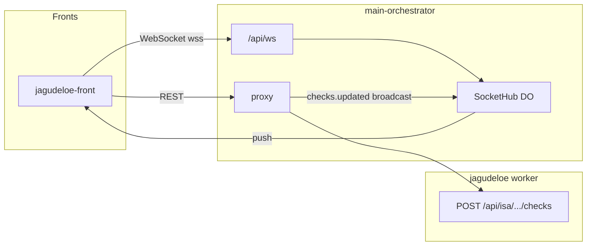

# Realtime (WebSocket) — Jeff-Aporta

Notificaciones en tiempo real vía **Cloudflare Durable Objects** en el orquestador (`main-orchestrator`).

## Arquitectura



## Endpoint

| Ruta | Uso |
|------|-----|
| `WS /api/ws` | Conexión WebSocket (desde `wss://{orquestador}/api/ws`) |
| `GET /` | Salud (sin prefijo `/api`) |

Tras un `POST /api/isa/{project}/checks` exitoso, el orquestador emite a todos los clientes conectados:

```json
{
  "type": "checks.updated",
  "project": "patyia",
  "revisadoKey": "patyia:bitacora:2026-06-10",
  "checked": true,
  "at": 1718112000000
}
```

## front-shared (CDN)

| Módulo | Descripción |
|--------|-------------|
| `cdn/isa/js/core/realtime.js` | Cliente WebSocket + reconexión + evento `isa:realtime` |
| `cdn/isa/js/ui/toast.js` | Toasts DOM ligeros (`ISAFront.showToast`) |

## Registro (opt-in)

Realtime **no** se activa por defecto. Solo conecta si la app lo registra explícitamente **y** el usuario tiene sesión + capacidad `signalr` en BD_AUTH.

```javascript
ISAFront.registerApp({
  ns: "ISAJ",
  session: true,
  realtime: { autoStart: true },  // conecta tras login si can("signalr")
  toast: true,
});
```

Sin `realtime` en `registerApp`: sin WebSocket, sin dot verde en la toolbar.

Capacidad: `signalr` (`REALTIME_CAP` en `realtime.js`).

Escuchar mensajes:

```javascript
window.addEventListener(ISAFront.REALTIME_EVENT, (e) => {
  const msg = e.detail;
  if (msg.type === ISAFront.REALTIME.CHECKS_UPDATED) { /* … */ }
});
```

## jagudeloe (preparado, desactivado)

- `js/ui/realtime.ts` — hook `useRealtimeNotifications` (escucha eventos; sin conexión hasta opt-in)
- `App.jsx` — toast al recibir `checks.updated` cuando realtime esté habilitado
- **Sin** `realtime` en `isa-setup.ts` hasta conceder capacidad `signalr` por rol

## Añadir a otro front

1. Conceder capacidad `signalr` al rol en BD_AUTH
2. `registerApp({ realtime: { autoStart: true } })` en `isa-setup.ts`
3. Copiar/adaptar `realtime.ts` o escuchar `isa:realtime`
4. Mostrar toast con `window.{NS}.Toast.show(...)`

Requiere **Workers Paid** o migración `new_sqlite_classes` para Durable Objects (configurado en `main-orchestrator/backend/wrangler.toml`).
