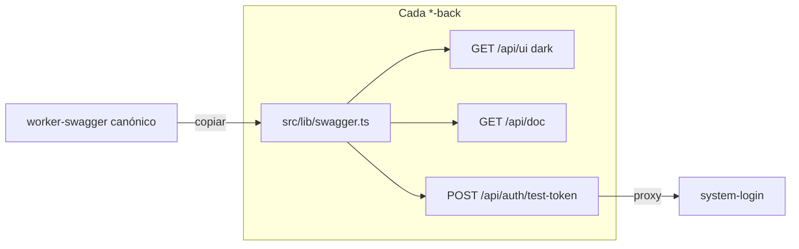

# Swagger / OpenAPI — Workers Jeff-Aporta

Cada backend expone documentación bajo **`/api/`** (salud en `/`).

## Arquitectura



| Ruta | Contenido |
|------|-----------|
| `GET /` | Health JSON |
| `GET /api/doc` | Especificación OpenAPI 3.0 (`openapi.json`) |
| `GET /api/ui` | Swagger UI interactiva (dark mode) + panel JWT de prueba |
| `POST /api/auth/token` | Proxy → system-login (excepto system-login nativo) |
| `POST /api/auth/test-token` | Proxy → system-login — JWT Swagger 1 h |

## JWT de prueba en Swagger

Todas las UIs incluyen un panel **«JWT de prueba (1 hora)»** arriba de la documentación:

1. Ingresa usuario y contraseña de la organización.
2. El panel llama `POST /api/auth/test-token` en **el mismo Worker** (proxy a system-login).
3. El JWT se aplica automáticamente al esquema **Bearer** de Swagger.

```
POST /api/auth/test-token
{ "username": "…", "password": "…" }   // contraseña con transporte César (automático en el panel)
```

Respuesta: JWT con `purpose=swagger-test` y expiración **1 hora**.

- Auth real: `https://system-login.jeffaporta.workers.dev`
- Local auth: `http://localhost:8781` (el proxy lo resuelve en `wrangler dev`)

Login normal de apps (`POST /api/auth/token`) sigue emitiendo JWT de **30 días**.

## Integración

1. Copiar `swagger.ts` y `auth-proxy.ts` → `{backend}/src/lib/`
2. Crear `{backend}/src/openapi/spec.ts` con paths del servicio + `...authOpenApiPaths()`
3. En `index.ts`:

```typescript
import { mountAuthProxy } from "./lib/auth-proxy.js";
import { mountSwagger } from "./lib/swagger.js";
import { openApiSpec } from "./openapi/spec.js";

// No montar mountAuthProxy en system-login (rutas nativas).
mountAuthProxy(app);
mountSwagger(app, openApiSpec);
```

4. Dependencias: `@hono/swagger-ui`, `hono`

Swagger UI se carga en **v5.31+** con clase `dark-mode` en `<html>` (tema oscuro fijo).

## Actualizar documentación

Editar `src/openapi/spec.ts` cuando agregues rutas.

Tras cambiar `swagger.ts` o `auth-proxy.ts` canónicos, volver a copiar a todos los backends y **desplegar** los Workers.
